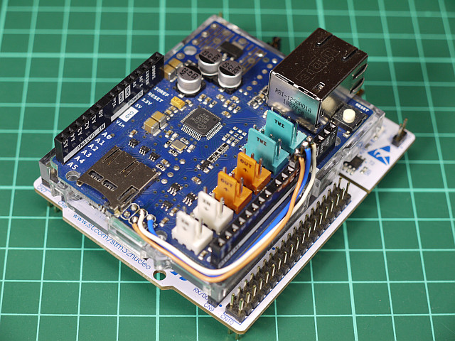

# Customized versions of SOEM4Mbed

## GR-MANGO

The GR-MANGO doesn't support `Ethernet` class for handling RAW Ethernet frames. Therefore the customized SOEM library for GR-MANGO uses the low level Ethernet driver of RZ/A2M. 

[SOEM for GR-MANGO](GR-MANGO)

## NUCLEO-F767ZI

The NUCLEO-F767ZI doesn't support `Ethernet` class for handling RAW Ethernet frames. Therefore the customized SOEM library for NUCLEO-F767ZI uses the low level Ethernet driver of STM32F7 (STM32F7 HAL library). 

[SOEM for NUCLEO-F767ZI](NUCLEO-F767ZI)

## NUCLEO-F446RE

The NUCLEO-F446RE doesn't support `Ethernet` class for handling RAW Ethernet frames. In addition, the NUCLEO-F446RE has no PHY chip and no RJ45 connector. Therefore the customized SOEM library for NUCLEO-F446RE uses the Arduino Ethernet Shield 2.

The Arduino Ethernet Shield 2 uses Arduino ICSP port as a SPI port, but the NUCLEO-F446RE has no Arduino ICSP port. Therefore you have to modify your Arduino Ethernet Shield 2. Please connect D11(MOSI), D12(MISO) and D13(SCK) to corresponding pins of the ICSP port via wires.

[SOEM for NUCLEO-F446RE](NUCLEO-F446RE)

## mbed LPC1768

The LPC1768 has only 64kB RAM. In addition, LPC1768's RAM is divided into 3 blocks (AHBSRAM, AHBSRAM0, AHBSRAM1). Therefore the customized SOEM library reduces RAM usage and allocates buffer variables to the vacant area.

The mbed LPC1768 board needs a external RJ45 connector.  

[SOEM for LPC1768](LPC1768)
